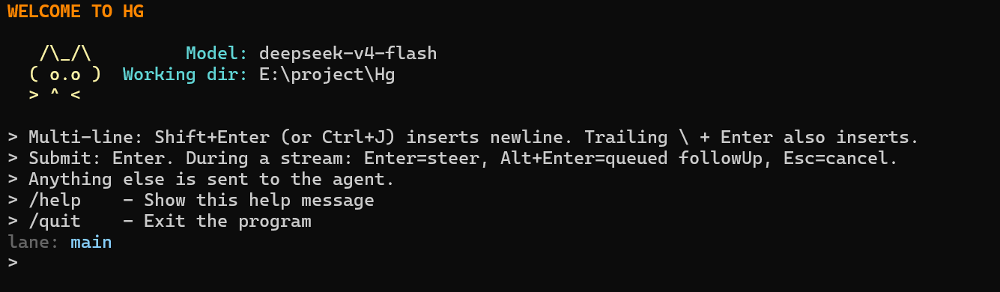

# Hg

[English](README.md) | [中文](README.zh.md)



## Quick Start

```bash
git clone <repo> && cd Hg
pip install -r requirements.txt   # or install deps manually
python main.py                    # interactive CLI
```

First launch wires up the LLM client (default: `deepseek-v4-flash` via
`https://api.deepseek.com`), loads skills from `./skills`, creates a
session in `./sessions/`, registers built-in tools, and drops you at
the prompt.

Multi-line input: `Shift+Enter` (or `Ctrl+J`).

## Features

- **ReAct loop** — `IDLE → THINKING → PARSING → VALIDATING → ACTIVE → OBSERVING → APPROVAL_WAITING → FINISHED` with cancel/abort propagation.
- **Built-in tools** — `bash`, `read`, `write`, `edit`, `ls`, `find`, `grep`.
- **Progressive skill disclosure** — non-gated tools always visible; gated tools appear only after `activate_skill`.
- **Human approval gate** — tools flagged `dangerous=True` block on a timeout-bounded approval prompt.
- **Anti-oscillation watchdog** — sliding-window detector that breaks tool-call loops before they spin out.

## CLI Flags

| Flag | Purpose |
|------|---------|
| `--cwd <path>` | Force a working directory for built-in tools. |
| `--resume [id]` | Resume a session. With no id, list and prompt. |
| `--continue-last` | Resume the most recently modified session. |
| `--no-drift-check` | Don't error if a resumed session's cwd no longer exists. |

## In-Session Commands

| Command | What it does |
|---------|--------------|
| `/help` | List every slash command. |
| `/tools` | List registered tool names. |
| `/status` | Show session id, model, lane, leaf, entry count. |
| `/session` | Detailed session info. |
| `/cancel` | Abort the current run. |
| `/compact [hint]` | Trigger context compaction. |
| `/fork [label]` | Fork the session at the current leaf. |
| `/new` | Start a new session. |
| `/resume` | List and switch sessions. |
| `/quit` | Exit. |

Anything else is sent to the agent.

## Configuration

Edit `harness.yaml`:

```yaml
llm:
  api_key: "sk-..."          # or set AGENT_LLM_API_KEY env var
  base_url: "https://api.deepseek.com/v1"
  model: "deepseek-v4-flash"

paths:
  skills_dir: "./skills"
  sessions_dir: "./sessions"
```

Any OpenAI-compatible endpoint works.

## License

MIT.
